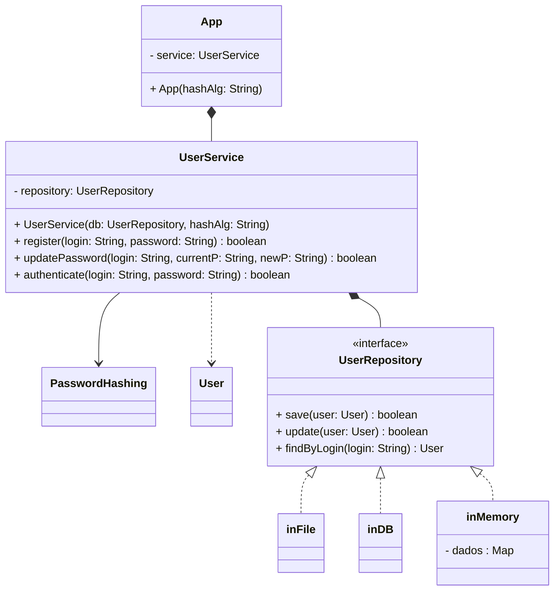

```mermaid
classDiagram
    direction TB
    
    class PasswordHashing
    class App{
        - service: UserService
        + App(hashAlg: String)
    }
    
    class User
    class UserService{
        - repository: UserRepository
        + UserService(db: UserRepository, hashAlg: String)
        + register(login: String, password: String) boolean
        + updatePassword(login: String, currentP: String, newP: String) boolean
        + authenticate(login: String, password: String) boolean
    }
    class UserRepository{
        <<interface>>
        + save(user: User) boolean
        + update(user: User) boolean
        + findByLogin(login: String) User
    }
    class inMemory{
        - dados : Map<String, User>
    }
    UserRepository <|.. inFile
    UserRepository <|.. inDB
    UserRepository <|.. inMemory
    App *-- UserService
    UserService ..> User
    UserService *-- UserRepository
    UserService --> PasswordHashing
    

```